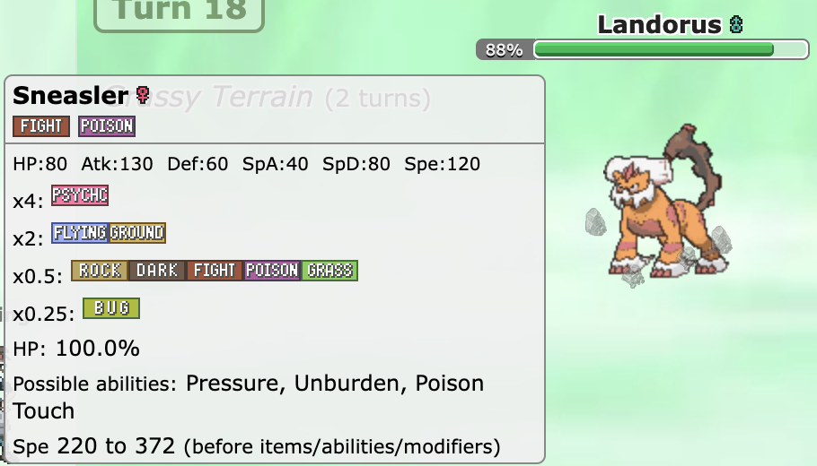
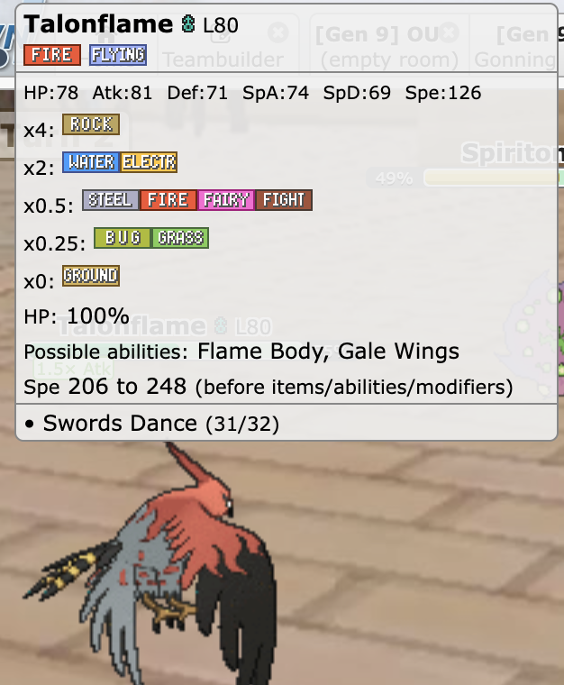

# Kibi – Pokémon Showdown Tooltip Helper (DE / EN)

  
  
  

| 🇩🇪 Deutsch                                                                                                                                                                                                                                                                                                             | 🇺🇸 English                                                                                                                                                                                                                                                   |
| ---------------------------------------------------------------------------------------------------------------------------------------------------------------------------------------------------------------------------------------------------------------------------------------------------------------------- | ------------------------------------------------------------------------------------------------------------------------------------------------------------------------------------------------------------------------------------------------------------ |
| **Kibi – Der Pokémon Showdown Tooltip Helfer**                                                                                                                                                                                                                            | **Kibi – The Pokémon Showdown Tooltip Helper**                                                                                                                                                                  |
| **Beschreibung:** Kibi erweitert die Tooltips von [Pokémon Showdown](https://pokemonshowdown.com) um zusätzliche Informationen – inklusive Typenschwächen und Statuswerte. So behältst du im Kampf immer den Überblick.                                                                                             | **Description:** Kibi enhances tooltips on [Pokémon Showdown](https://pokemonshowdown.com) with additional information – including type weaknesses and stats. Keep full control of your battles at a glance.                                              |
| **✨ Features:** - 🔍 Zeigt Typ-Schwächen und Resistenzen direkt im Tooltip - 📊 Ergänzt Basiswerte (Stats) für schnelle Übersicht - 🎨 Darkmode-Unterstützung - ⚡ Funktioniert nahtlos in Pokémon Showdown                                                                                               | **✨ Features:** - 🔍 Shows type weaknesses and resistances directly in the tooltip - 📊 Adds base stats for quick overview - 🎨 Dark mode support - ⚡ Works seamlessly in Pokémon Showdown                                                     |
| **📸 Screenshots:**                                                                                                                                                                                                  | **📸 Screenshots:**                                                                                                                                        |
| **⚙️ Installation:** **Aus Quellcode bauen & installieren:** 1. Repository klonen und Abhängigkeiten installieren: `npm install` `npm run build` 2. Die gebaute, entpackte Erweiterung befindet sich im Ordner `dist/`. 3. Browser: Erweiterungen → Entpackte Erweiterung laden → `dist/` auswählen. | **⚙️ Installation:** **Build & Install from Source:** 1. Clone repository and install dependencies: `npm install` `npm run build` 2. Built unpacked extension located in `dist/`. 3. Browser: Extensions → Load unpacked → select `dist/`. |
| **📌 Hinweise:** - Getestet mit Chrome und Opera (funktioniert auch in Chromium-Browsern) - Pokémon-Daten werden live aus der PokéAPI geladen                                                                                                                                                                    | **📌 Notes:** - Tested on Chrome and Opera (should also work on Chromium browsers) - Pokémon data is loaded live from the PokéAPI                                                                                                                      |
| **🤝 Mitwirken:** Pull Requests, Bug Reports und Feature-Ideen sind willkommen! Schau in die Issues und hilf, Kibi noch besser zu machen.                                                                                                                                                                           | **🤝 Contributing:** Pull requests, bug reports, and feature ideas are welcome! Check issues and help make Kibi even better.                                                                                                                              |
| **📝 TO-DO:** - [ ] Weitere Features implementieren - [X] Darkmode-Optimierungen - [ ] Weitere Browser testen - [ ] Einstellungen hinzufügen                                                                                                                                                               | **📝 TO-DO:** - [ ] Implement more features - [X] Optimize dark mode - [ ] Test on additional browsers - [ ] adding Settings                                                                                                                     |
| **📜 Credits:** Original Owner: [coltonb](https://github.com/coltonb/pokemon-showdown-type-helper)                                                                                                                                                                                                                  | **📜 Credits:** Original Owner: [coltonb](https://github.com/coltonb/pokemon-showdown-type-helper)                                                                                                                                                        |
